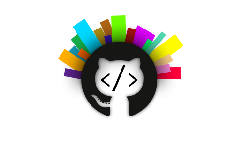

# GitHub programming languages analysis
This project aims to show the popularity of programming languages that are used on [GitHub](https://github.com/) through years.

Our main challenge was to illustrate programming languages evolution through the years. In order to do that, we have retrieve a lot of data (i.e. repositories and their metadata) on [GitHub API](https://developer.github.com/v3/). After that, we have processed all these repos into a JSON file. We have produced a chord diagram with some parameters to visualize it nicely and a bar chart to compare the poplarity of languages between years.

## Installation

No installation is required, simply go to https://nellybarret.github.io/GithubLanguagesAnalysis/

## Release History

* 11/20/2019
    * submitted the idea of our project to our teacher
* 11/26/2019
    * defined the structure of our project, the challenges
    * defined roles for each member of the group
* 12/18/2019
    * get a peer-review of our project by another team
* 01/09/2020
    * presentation of our project
    * get reviews by teachers
* 01/16/2020
    * integration of the teachers' suggestions in our project

## Our inspiration

* [This paper](https://web.cs.ucdavis.edu/~filkov/papers/lang_github.pdf) established a comparison between 17 programming languages in order to order them by a score. This score is based on the number of projects that used the language, the number of authors, the number of commits and some others indicators.
* And our minds to think about a great project for our data visualization course !

## Contributors

[Nelly Barret](nelly.barret@etu.univ-lyon1.fr) ([website](http://www.nellybarret.fr/)) – [Jonathan Cabezas](jonathan.cabezas@etu.univ-lyon1.fr) - [Luc Gombert](luc.gombert@etu.univ-lyon1.fr) - [Juliette Reisser](juliette.reisser@etu.univ-lyon1.fr)

Students in [M2 Artificial Intelligence](http://master-info.univ-lyon1.fr/IA/) and [M2 Data Science](http://master-info.univ-lyon1.fr/DS/) in Lyon 1 University.

Supervised by Mr. Aurélien Tabard, our teacher of [Data Vizualisation](https://lyondataviz.github.io/teaching/lyon1-m2/2019/)
